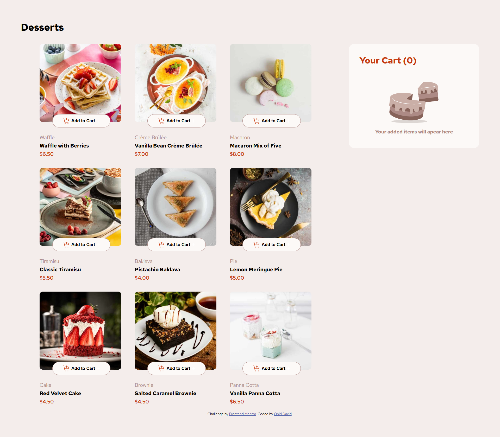

# Frontend Mentor - Product List with Cart Solution

This is a solution to the [Product list with cart challenge on Frontend Mentor](https://www.frontendmentor.io/challenges/product-list-with-cart-5MmqLVAp_d). Frontend Mentor challenges help you improve your coding skills by building realistic projects.

## Table of contents

- [Overview](#overview)
  - [The challenge](#the-challenge)
  - [Screenshot](#screenshot)
  - [Links](#links)
- [My process](#my-process)
  - [Built with](#built-with)
  - [What I learned](#what-i-learned)
  - [Continued development](#continued-development)
  - [Useful resources](#useful-resources)
- [Author](#author)
- [Acknowledgments](#acknowledgments)

## Overview

### The challenge

Users should be able to:

- Add items to the cart and remove them
- Increase/decrease the number of items in the cart
- See an order confirmation modal when they click "Confirm Order"
- Reset their selections when they click "Start New Order"
- View the optimal layout for the interface depending on their device's screen size
- See hover and focus states for all interactive elements on the page

### Screenshot



### Links

- Solution URL: [solution URL here](https://github.com/isnirvana/cart-project)
- Live Site URL: [live site URL here](https://shopping-cart-nirvana.netlify.app/)

## My process

### Built with

- Semantic HTML5 markup
- CSS custom properties
- Flexbox
- CSS Grid
- Vanilla JavaScript

### What I learned

This project helped me better understand JavaScript's modular approach and DOM manipulation. For example, creating reusable functions to manage cart operations improved my code's maintainability:

```javascript
export function isProductInCart(productName) {
  return cart.find((item) => {
    return item.productName === productName.textContent
  })
}
```

I also reinforced my understanding of handling dynamic content updates with event listeners and real-time calculations.

### Continued development

In future projects, I plan to:

- Implement local storage to persist cart data between sessions.
- Add user authentication to save cart data to a database.
- Enhance the UI with animations and improve responsiveness for all screen sizes.

### Useful resources

- [MDN Web Docs](https://developer.mozilla.org/) - Comprehensive resource for JavaScript and web development concepts.
- [Frontend Mentor Community](https://www.frontendmentor.io/) - Great platform for getting feedback and inspiration.
- [ChatGPT](https://chatgpt.com/) - Great AI tool for understanding concepts you've never tackled before


## Author

- Frontend Mentor - [@isnirvana](https://www.frontendmentor.io/profile/yourusername)
- Twitter - [@iss_nirvana](https://www.twitter.com/iss_nirvana)

## Acknowledgements

I would like to thank the **Frontend Mentor** community for their invaluable support and inspiration throughout this challenge. 

A special thank you goes to my mentor, **Kewa Blay**, for his guidance and encouragement. You can find Kewa Blay on GitHub here: [Kewa Blay](https://github.com/kewablay).


